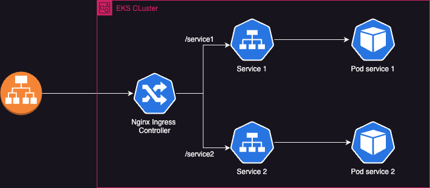

# Nginx Ingress controller

Using a Nginx as an Ingress Controller to enhance income traffic.

This is a simple example of Nginx Ingress Controller implemented with terraform.





## Deploy using

```terraform plan```

```terraform apply```

## Lint

`terraform fmt -recursive ../../ `

## Destroy using

```terraform destroy```


## Update eks config locally

`aws eks --region eu-central-1 update-kubeconfig cluster`


